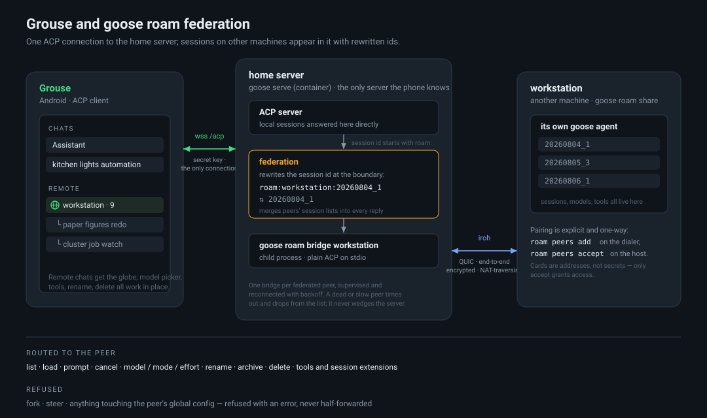

# Grouse

A native Android client for a self-hosted [goose](https://github.com/block/goose), spoken to
over ACP.

> **Alpha.** It works and is used daily, but it is one person's app against an explicitly
> unstable protocol. Expect rough edges, and expect goose updates to occasionally break things.

## What it is

The phone is a thin client. The goose server holds everything that matters — sessions, memory,
extensions, model choice, recipes, schedules — and this is an ACP client plus a chat UI over
it. Almost nothing is kept on the phone that the server does not already own.

Other clients see the same state: a chat started here shows up in Goose Desktop and the CLI,
and the other way round.

- Chat with streaming, tool calls and images
- Session list, rename, archive, projects
- Extension and tool management
- Model/provider picker
- Recipes and schedules
- Quick Settings tile, share target, notification replies
- Optional biometric lock

## Requirements

A reachable `goose serve` with a secret key:

```sh
goose serve --host 0.0.0.0 --port 3284
```

Set `GOOSE_SERVER__SECRET_KEY` in its environment — that is the key the app asks for. The app
sends it as `X-Secret-Key` on the WebSocket upgrade (or `?token=` where a header cannot be set).

**Expose it carefully.** goose is an agent with shell access: anything that can reach this
endpoint can run commands as the user running goose. A VPN or overlay network is the sane
default. If it must be on the internet, put real authentication in front of it — the secret key
alone is one shared credential.

For TLS, `goose serve` also takes `--tls --tls-cert-path … --tls-key-path …`. With a
self-signed certificate the app pins the fingerprint on first connect.

## Building

JDK 17 and the Android SDK.

```sh
./gradlew :app:assembleDebug
```

The APK lands in `app/build/outputs/apk/debug/`.

## First run

The app asks for host, port, secret key, and a **working directory** — an absolute path *on the
server*. goose validates that `session/new`'s cwd is absolute and has no default of its own, so
it has to be supplied.

The phone shares no filesystem with the server: a path typed here is a claim about a machine
the app cannot see.

## Assistant mode

Off by default. It surfaces one persistent thread kept fed by scheduled recipes that run
server-side — a setup a particular server has, not something a stock `goose serve` provides.
With it off this is a plain chat client. Settings › Assistant turns it on.

## Remote sessions (roam)

This branch works against the `feat/acp-federate-roam` branch of
[ccgauvin94/goose](https://github.com/ccgauvin94/goose): that server merges sessions from
other machines — reached over goose's roam transport — into its own session list, addressed
as `roam:<peer>:<session id>`. The phone keeps its single connection; prompts, config
changes, renames and tool edits for those sessions are forwarded to the machine that owns
them.

Being clear about what is and isn't standard here: the *methods* are ordinary ACP — the
same session, config and tool calls used for local sessions. The *addressing* is not.
`roam:<peer>:<id>` is a private convention of that fork, and this branch of Grouse knows
it and special-cases federated sessions wherever treating them as local would be wrong:

- The drawer groups them under a per-peer REMOTE section (globe icon) instead of by
  project — their project ids belong to the peer, not this server.
- The model picker offers only the options the peer reported for that session; the live
  model list fetched from the local provider doesn't apply there and is suppressed.
- A remote session's settings are never saved as local defaults for new chats.
- The tool sheet shows only what the peer's session reports, and only ever writes back
  objects it got from the peer — a same-named local extension may not exist there.
  Extensions not attached to the remote session can't be listed.
- Move-to-project and export stay local-only.

`ConnectionManager.roamPeer()` is the single place the id convention is parsed; if the
scheme changes, that is the one thing to update.

The server needs `GOOSE_ROAM_FEDERATE=<peer names>` set and a `goose roam share` running
on each peer. An offline peer's sessions drop out of the list until it returns.



## Compatibility

Against a stock `goose serve` this branch behaves exactly like master: a stock server
never produces `roam:` session ids, so every roam code path stays dormant and the app is a
plain ACP client. The remote-session feature itself is **not** stock — it needs the fork
named above, and the `roam:` addressing is a convention shared between that fork and this
branch, not part of ACP or upstream goose.

goose's ACP surface is explicitly unstable — the methods live under `_goose/unstable/` — so a
goose upgrade can change or remove things this app calls. Please open an issue if something
breaks.

## Licence

AGPL-3.0. See [LICENSE](LICENSE).
